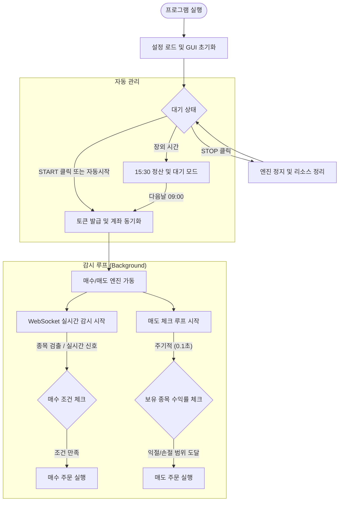
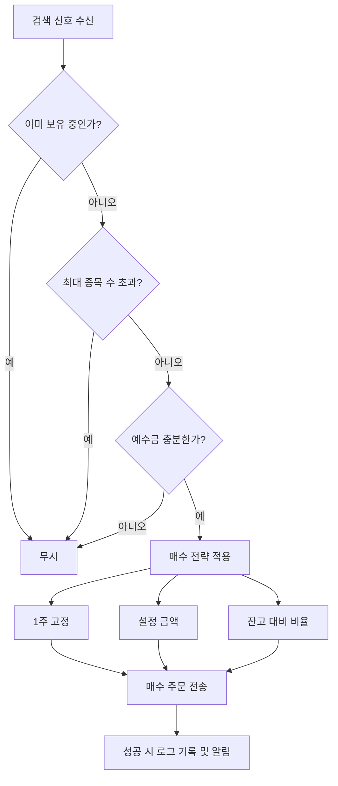
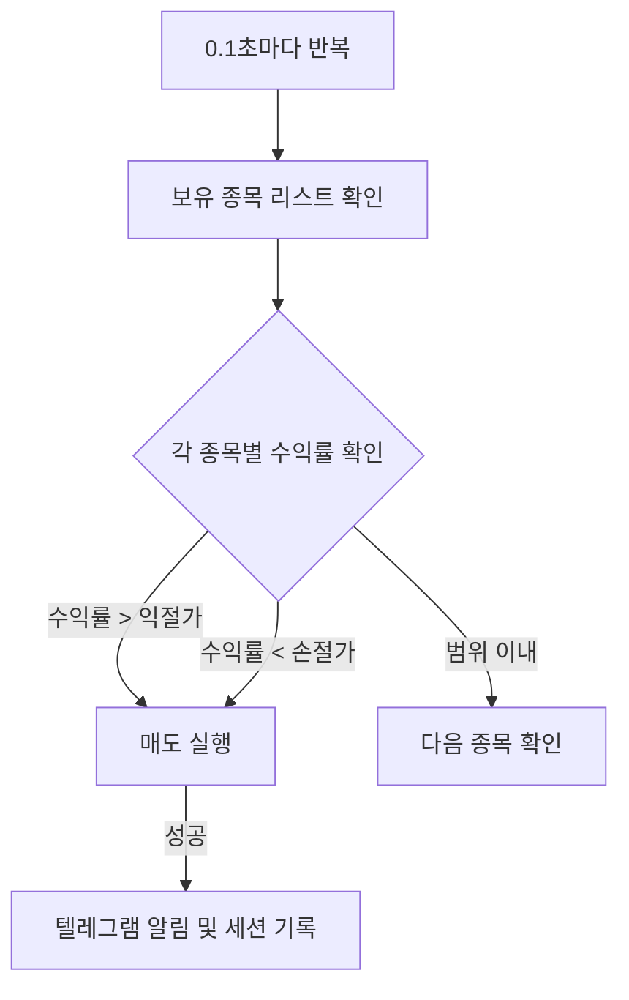

# 📊 KipoStock 전체 시스템 흐름도 (Flowchart)

이 문서는 `KipoStock` 자동 매매 시스템의 전체적인 동작 흐름을 시각적으로 설명합니다.

## 1. 메인 프로세스 흐름

## 2. 매수 로직 상세 (chk_n_buy)

## 3. 매도 로직 상세 (chk_n_sell)

---
*이 플로우차트는 KipoStock V5.3.9 기준으로 작성되었습니다.*
