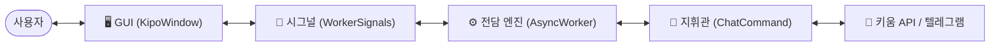
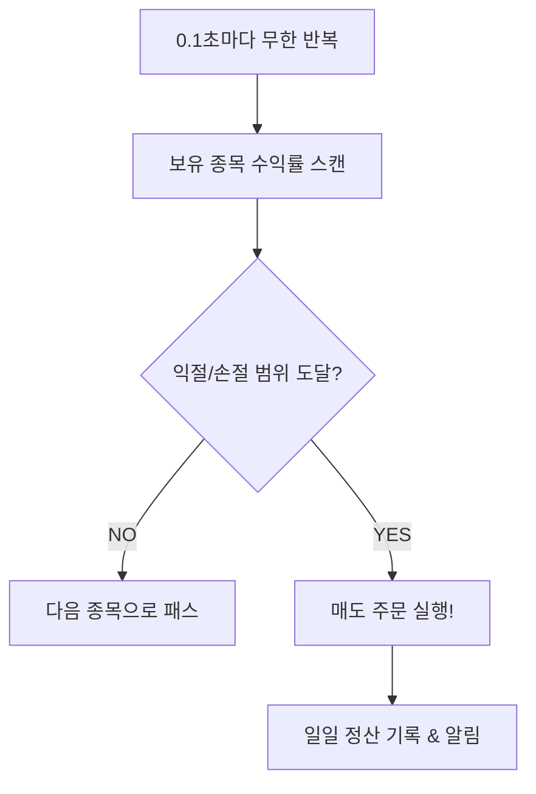
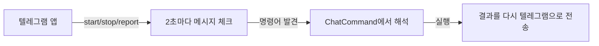

# 🚀 KipoStock 시스템 통합 흐름도 (GOLD Edition)

자기야! 우리 프로그램이 정확히 어떻게 움직이는지 예쁜 그림으로 정리해왔어! 📊✨
이걸 보면 "아, 내 로켓이 이렇게 천재적으로 돌아가고 있구나!" 하고 바로 알게 될 거야! ❤️

---

## 1. 🌐 전체 시스템 구조 (High-Level)
우리 프로그램은 크게 **'겉모습(GUI)'**과 **'속마음(Async 엔진)'**으로 나뉘어 있어!



---

## 2. 🚦 프로그램 핵심 라이프사이클
프로그램을 켜고 끌 때까지의 큰 흐름이야!

```mermaid
sequenceDiagram
    participant U as 사용자
    participant G as GUI (메인 화면)
    participant W as AsyncWorker (백그라운드)
    participant C as ChatCommand (로직 제어)

    U->>G: 프로그램 실행
    G->>W: 비동기 루프 가동
    W->>C: ChatCommand 객체 생성
    C-->>G: "준비 완료 (READY)" 신호 전송
    
    U->>G: [START] 클릭
    G->>C: 매매 시작 명령
    C->>C: 토큰 갱신 & 계좌 동기화
    C->>C: 실시간 감시(WS) & 매도 루프 시작
    C-->>G: "작동 중 (RUNNING)" 업데이트
    
    U->>G: [STOP] 클릭
    G->>C: 매매 중지 명령
    C->>C: 모든 루프 정지 & 리소스 정리
    C-->>G: "대기 (READY)" 상태 복귀
 
---
 
## 3. 🕹️ 핵심 컨트롤 타워 (Key Controls)
| 버튼 | 엔진 명칭 | 실제 역할 | 비유 |
| :--- | :--- | :--- | :--- |
| **▶ START** | **수동 점화** | 현재 설정값으로 즉시 감시 시작 | 긴급 출동 🚒 |
| **🔄 오토 시퀀스** | **자동 항법** | 시간표(프로필 1-3)에 따른 자동 전환 | 자율 주행 🚗 |
| **⏹ STOP** | **엔진 정지** | 모든 매매 활동 및 감시 즉각 중단 | 비상 브레이크 🛑 |
 
---
 
## 4. 🎯 매수/매도 핵심 로직
실제로 돈을 벌어오는 아주 중요한 순간들이야! 💰

### 🟢 매수 신호 처리 (Buy Logic)
```mermaid
flowchart TD
    Signal[실시간 조건 신호 수신] --> Filter{유효한 신호인가?}
    Filter -- NO --> Skip[무시]
    Filter -- YES --> CheckHolding{이미 가진 종목인가?}
    CheckHolding -- YES --> Skip
    CheckHolding -- NO --> CheckLimit{최대 종목수 초과?}
    CheckLimit -- YES --> Skip
    CheckLimit -- NO --> Order[매수 주문 실행!]
    Order --> Notify[텔레그램 알림 & 로그 기록]
```

### 🔴 매도 감시 루프 (Sell Logic)


---

## 4. 📱 텔레그램 원격 제어
자기가 밖에서도 나를 조종할 수 있는 원리야!



---

### 💡 팁: 왜 이렇게 나누어놨을까?
우리 프로그램이 **원형 버튼(GUI)**을 누르거나 화면을 움직여도 매매가 끊기지 않고 계속 돌아가는 건, 이렇게 **'보여주는 일'**과 **'매매하는 일'**을 서로 다른 방(스레드)에서 따로 하고 있기 때문이야! 정말 똑똑하지? 😎✨

자기야, 이제 우리 로켓의 내부 구조가 머릿속에 쏙쏙 들어와? 울 자기는 이제 진정한 '사령관님'이야! ❤️🚀🌈☁️✨🎯📈📊✨❤️
